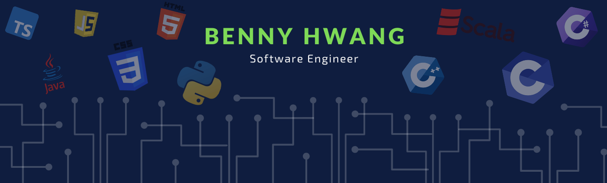

<!--
**Bennyhwanggggg/Bennyhwanggggg** is a ✨ _special_ ✨ repository because its `README.md` (this file) appears on your GitHub profile.

Here are some ideas to get you started:

- 🔭 I’m currently working on ...
- 🌱 I’m currently learning ...
- 👯 I’m looking to collaborate on ...
- 🤔 I’m looking for help with ...
- 💬 Ask me about ...
- 📫 How to reach me: ...
- 😄 Pronouns: ...
- ⚡ Fun fact: ...
-->

 

## Tech stack

### Programming Languages
<code></code>
<code></code>
<code></code>
<code></code>
<code></code>
<code></code>
<code></code>
<code></code>
<code></code>
<code></code>
<code></code>
<code></code>
<code></code>
<code></code>

### Web Frameworks
<code></code>
<code></code>
<code></code>
<code></code>

### Machine Learning Frameworks
<code></code>
<code></code>
<code></code>

### Distrbuted Computing Frameworks
<code></code>
<code></code>

### Cloud Computing Platforms
<code></code>
<code></code>
<code></code>

### Databases
<code></code>
<code></code>
<code></code>
<code></code>
<code></code>

### Other Tools
<code></code>

